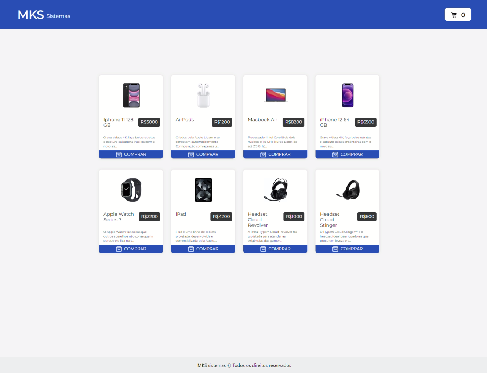

# REACT ECOMMERCE

## Visão Geral
Este é um projeto de aplicativo web de e-commerce construído com React. Ele permite que os usuários naveguem pelos produtos disponíveis, adicionem itens ao carrinho de compras, removam itens do carrinho e finalizem a compra.

## Demonstrativo (vídeo)

🎥 

## Funcionalidades Principais
- Visualização de Produtos: Os usuários podem visualizar uma lista de produtos disponíveis para compra.
- Adição ao Carrinho: Os usuários podem adicionar itens ao carrinho de compras.
- Remoção do Carrinho: Os usuários podem remover itens do carrinho de compras.
- Atualização de Quantidade: Os usuários podem atualizar a quantidade de itens no carrinho de compras.
- Finalização da Compra: Os usuários podem finalizar a compra e concluir o processo de checkout.

## Instalação
Para executar este projeto localmente, siga estas etapas:

1. Clone este repositório para o seu ambiente local.
2. Navegue até o diretório do projeto no terminal.
3. Execute o comando npm install para instalar as dependências.
4. Após a instalação das dependências, execute o comando npm start para iniciar o servidor de desenvolvimento.
5. Abra seu navegador e vá para http://localhost:3000 para visualizar o aplicativo.

## Tecnologias e Ferramentas Utilizadas
- React: O projeto é desenvolvido utilizando a biblioteca React para a construção da interface do usuário.
- Styled Components: Styled Components é utilizado para a estilização dos componentes.
- React Bootstrap: React Bootstrap é utilizado para a criação de componentes UI.
- Jets: Para criação e execução de testes unitários.
  
## Créditos
Desenvolvido por [Igor Barcelo](https://github.com/IgorBarcelo)
